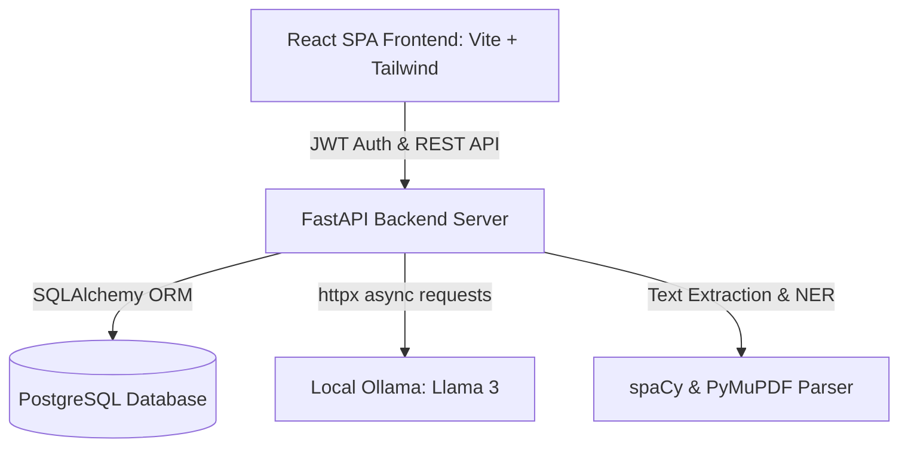
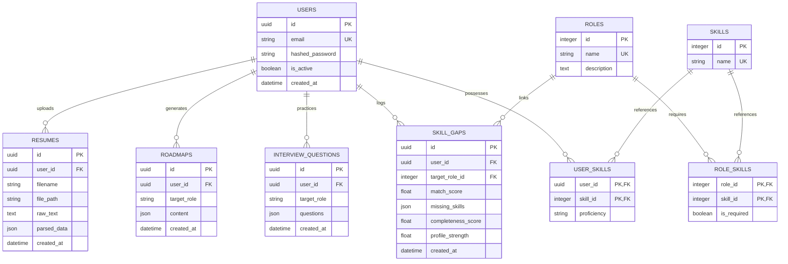

# Intelligent Career Development Platform: Interview Ready Study Guide

This guide is designed to take you from knowing nothing about the codebase to understanding its architecture, design decisions, data schemas, and key engineering challenges. Use this to prepare for software engineering, full-stack, backend, and AI engineering interviews.

---

## 1. Project Overview & System Architecture

### What is the Platform?
The **Intelligent Career Development Platform** is a full-stack, AI-augmented web application designed to help job seekers bridge the gap between their current resume capabilities and the requirements of their target career profiles.

### Core Value Proposition
- **Deterministic Resume Parsing**: Standardizes input PDFs into strict structures.
- **Skill Gap Matrices**: Compares parsed candidate skills against standard role requirements.
- **AI-Powered Learning Roadmaps**: Leverages local LLMs (Llama 3 via Ollama) to outline weekly plans with recommended learning links.
- **Adaptive Mock Interviews**: Generates mock technical, behavioral, and follow-up questions tailored to the candidate's exact skill gaps.

### System Diagram


---

## 2. Tech Stack Deep Dive (Why These Technologies?)

| Component | Technology | Why we chose it / Technical justification |
| :--- | :--- | :--- |
| **Frontend** | **React 19 & Vite 6** | React offers high-performance component rendering. Vite replaces legacy bundlers (like Webpack) providing instant hot module reloading (HMR) and fast build packaging. |
| **Styling** | **Tailwind CSS v4** | A utility-first styling engine with a modern CSS-based configuration. Eliminates heavy custom CSS files and supports rapid glassmorphism design layouts. |
| **Data Viz** | **Recharts** | Declarative charting built on React components. Used to render the candidate's Resume Evolution chart (Completeness vs. Skill Count). |
| **Backend** | **FastAPI (Python 3.12)** | Built on Starlette and Pydantic, FastAPI is one of the fastest Python frameworks. It utilizes Python's `async/await` syntax for high-concurrency connections and auto-generates interactive Swagger API docs. |
| **Database** | **PostgreSQL** | A production-grade relational database. Essential for managing complex relations (Users, Resumes, Roles, Skills, Gaps, Roadmaps) with relational integrity. |
| **ORM** | **SQLAlchemy** | Offers object-relational mapping to query PostgreSQL with safe Python classes instead of writing raw SQL strings, preventing SQL Injection vulnerabilities. |
| **AI Engine** | **Ollama (Llama 3)** | Runs open-source LLMs locally, ensuring user data privacy (resumes are not sent to third-party endpoints like OpenAI) and avoiding API access charges. |
| **NLP** | **PyMuPDF & spaCy** | `PyMuPDF` extracts raw text from PDF files. `spaCy` handles Named Entity Recognition (NER) to isolate candidate names and tokenize terms for key skill matches. |

---

## 3. Database Schema & Architecture

The database model is defined in `backend/app/db/models.py` and maps to PostgreSQL using SQLAlchemy:



### Strategic Design Choices
1. **Hybrid JSON/Relational Schema**: Raw text, parsed resume sections, roadmaps, and interview questions are stored inside **JSON/JSONB** columns. This allows storing unstructured data from AI models without needing complex table join structures.
2. **UUID Primary Keys**: Used for `Users`, `Resumes`, `Roadmaps`, and `InterviewQuestions` to prevent enumeration attacks (where malicious users try to guess numeric IDs like `/resumes/1`, `/resumes/2`).
3. **Foreign Key Cascade Deletes**: `ondelete="CASCADE"` is defined on `user_id` links. If a user deletes their account, all their uploaded resumes, gaps, and roadmaps are instantly purged from the DB automatically.

---

## 4. Key Engineering Challenges & Solutions

Be prepared to discuss these challenges in detail during system design or behavioral interviews:

### Challenge 1: The Bcrypt "Passlib" Hashing Crash (Python 3.12 Compatibility)
- **Problem**: Modern Python projects using FastAPI traditionally use `passlib.context.CryptContext` for password hashing. However, `passlib` is unmaintained and imports deprecated modules that throw runtime errors under Python 3.12, causing server startup crashes or bcrypt verification failures.
- **Solution**: We bypassed the `passlib` layer entirely and wrote direct wrappers around the native `bcrypt` package:
  - **Hashing**: `bcrypt.hashpw(password.encode("utf-8"), bcrypt.gensalt())`
  - **Verification**: `bcrypt.checkpw(plain_password.encode("utf-8"), hashed_password.encode("utf-8"))`
- **Interview Value**: Demonstrates your ability to debug dependency conflicts, handle language runtime updates (Python 3.12 compatibility), and write secure cryptographic abstractions.

### Challenge 2: LLM JSON Output Extraction (Dealing with LLM Hallucinations)
- **Problem**: When prompting Llama 3 to output JSON schemas, the LLM occasionally wraps responses in markdown ticks (e.g. ` ```json ... ``` `) or adds conversational text ("Sure, here is your JSON: ..."). Using regex lazy matching like `r"(\{.*?\})"` failed on nested JSON formats because the lazy wildcard matched only until the first closing brace (`}`), resulting in truncated, invalid JSON.
- **Solution**: We implemented an index-based boundary locator in `clean_json_string`:
  ```python
  start_idx = raw_str.find('{')
  end_idx = raw_str.rfind('}')
  if start_idx != -1 and end_idx != -1 and start_idx < end_idx:
      return raw_str[start_idx:end_idx + 1]
  ```
  This takes everything from the first `{` to the last `}` character, preserving all nested objects and arrays safely, then cleans up any residual markdown wrappers.
- **Interview Value**: Shows practical knowledge of prompt engineering, regex pitfalls, and writing resilient sanitization logic.

### Challenge 3: Balancing AI Latency & Determinism (System Design Boundary)
- **Problem**: LLMs are slow (inference takes seconds) and non-deterministic (scores for the same resume can vary on every run). Letting an LLM calculate "Skill Match Score" or "Profile Strength" would cause slow page loads and inconsistent metric displays.
- **Solution**: We drew a strict system boundary:
  - **Deterministic Python Engine**: Calculates metrics (Completeness, Match Score, recommended role checks) locally in microseconds using exact match algorithms.
  - **Generative AI Layer (Llama 3)**: Strictly reserved for qualitative text generation (weekly roadmaps, learning links, mock questions).
- **Interview Value**: Shows deep architectural judgment. You understand when to use AI (creativity, content generation) and when to use traditional code (speed, safety, absolute calculations).

### Challenge 4: Offline Resilience & High Availability
- **Problem**: Local Ollama instances might take time to boot up, time out, or not be running. We cannot let our server crash or hang when the AI engine is offline.
- **Solution**: Implemented an automatic try-except wrapper. If `httpx` queries to Ollama time out (45s limit) or throw a network error, the app catches the exception, logs it, and invokes a high-fidelity **Deterministic Fallback Engine** (`get_deterministic_roadmap_fallback` and `get_deterministic_interview_fallback`) to deliver a robust roadmap/interview set instantly based on missing skills.
- **Interview Value**: Highlights your dedication to software reliability, fallback architectures, and high availability.

---

## 5. Mock Technical Interview Q&A

### Q1: What is JWT Authentication and how does this application use it?
> **Answer**: JSON Web Token (JWT) is a stateless authentication mechanism. 
> 1. When a user logs in, the backend verifies their password, encodes their user UUID (`sub` claim) into a token payload, signs it using a HS256 secret key, and sends it to the client.
> 2. The client (React) stores this token in `localStorage`.
> 3. An Axios **request interceptor** automatically grabs this token and injects it into the `Authorization` header as a Bearer token for every subsequent API request.
> 4. The backend verifies the token signature on protected routes using standard JWT decode libraries to assert user identity. If expired or tampered with, it returns a `401 Unauthorized` status, which is caught by the frontend **response interceptor** to log the user out.

### Q2: Why did you choose spaCy over basic Regex matching for name parsing?
> **Answer**: Resumes vary wildly in format. Searching for a candidate's name using raw regex patterns is unreliable because names do not follow fixed patterns (like emails or phone numbers). 
> spaCy utilizes pre-trained machine learning Named Entity Recognition (NER) models. By tokenizing the resume text, spaCy identifies text labels with the entity type `PERSON` (individuals, including fictional). Combined with check rules (e.g. checking that the name appears in the top few lines of the resume text), it deterministically isolates candidate names with higher reliability than regex.

### Q3: How did you optimize database interactions in SQLAlchemy?
> **Answer**: 
> 1. **Index Optimization**: Added index parameters (`index=True`) on fields frequently used in filters, such as `User.email`, `Skill.name`, and `Role.name`.
> 2. **Cascading Relational purges**: Used `cascade="all, delete-orphan"` on relationships to prevent orphaned records in tables like `UserSkill` or `RoleSkill`.
> 3. **Connection Management**: Leveraged FastAPI's dependency injection (`Depends(get_db)`) to yield a database session per request, ensuring that database sessions are closed immediately after the request finishes to prevent connection leaks.

### Q4: If this project were scaled to production, what changes would you make?
> **Answer**: 
> 1. **Production LLM Hosting**: Move Ollama off localhost to a dedicated cloud VM with GPU acceleration (like AWS EC2 with NVIDIA A10G GPUs) or transition to an enterprise API gateway (like Azure OpenAI or Anthropic).
> 2. **Secure CORS configurations**: Change the backend CORS middleware `allow_origins=["*"]` to point to the specific production domains where the frontend React build is hosted.
> 3. **Secure Secrets Management**: Move the database URLs and JWT secret keys out of code files into a secure secrets manager (like AWS Secrets Manager or HashiCorp Vault) loaded into env variables at runtime.
> 4. **Caching Layer**: Place a Redis instance in front of PostgreSQL to cache generated roadmaps and parsed resumes, preventing redundant database hits and reducing latency.
